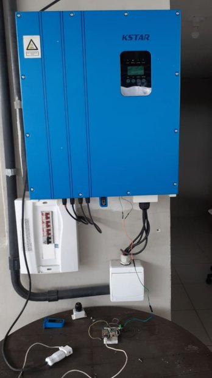
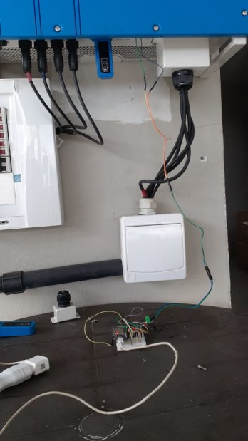
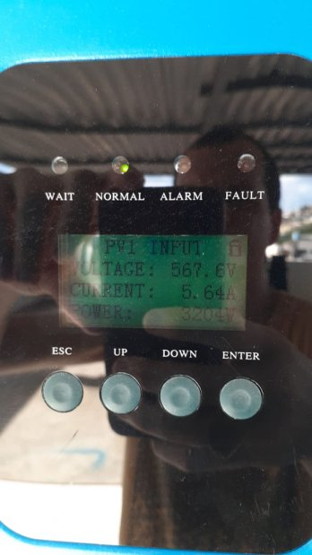
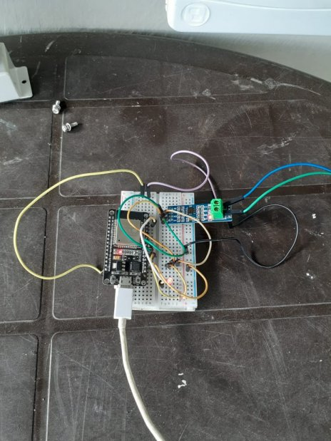
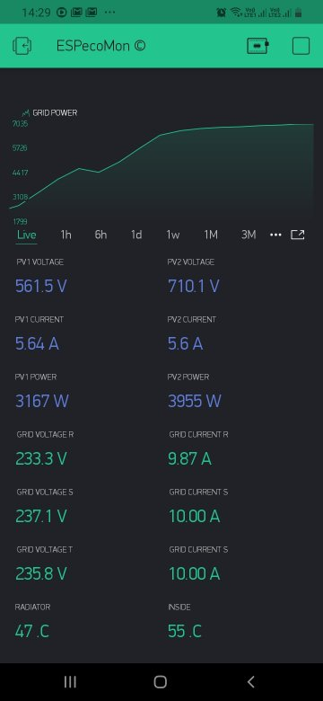

<h1 align="center">Kstart-RS485-Modbus-Blynk</h1>

## Objetivo

## Projeto feito para coletar dados do inversor Ktart via (RS-485 Modbus) com ESP32 e enviar os dados para o Blynk app.

## Projeto em construção, próxima fase é criar um app en React-Native.

## Hardware

* [Kstar](https://www.kstar.com/)

* [RS485 UART Module](https://lista.mercadolivre.com.br/rs485-conversor-ttl#D[A:rs485%20conversor%20ttl])

* [ESP32 Dev Board](https://lista.mercadolivre.com.br/esp32#D[A:esp32])

## Sample screenshot

## Video

https://youtu.be/awZt8eHfmbQ

## Software

* [Blynk](http://www.blynk.cc/) Mobile App ([iOS](https://itunes.apple.com/us/app/blynk-iot-for-arduino-rpi/id808760481?mt=8) & [Android](https://play.google.com/store/apps/details?id=cc.blynk&hl=en))
* Arduino IDE 1.6.9+
* The project sketch

## Setup

### Libraries

* [Blynk Library](https://github.com/blynkkk/blynk-library)
* [ModbusMaster](https://github.com/4-20ma/ModbusMaster)

## Tutorial

Em construção

## Como contribuir

- Faça um fork desse repositório;
- Cria uma branch com a sua feature: `git checkout -b minha-feature`;
- Faça commit das suas alterações: `git commit -m 'feat: Minha nova feature'`;
- Faça push para a sua branch: `git push origin minha-feature`.

Depois que o merge da sua pull request for feito, você pode deletar a sua branch.

## Author:

* **Paulo Vaz** - [LinkedIn](https://www.linkedin.com/in/paulo-vaz-05296a46/)

## Licença

Este projeto é licenciado sobre a licença MIT - veja [LICENSE.md](LICENSE.md) para mais informações.

# Kstart-RS485-Modbus-Blynk
# Kstart-RS485-Modbus-Blynk
